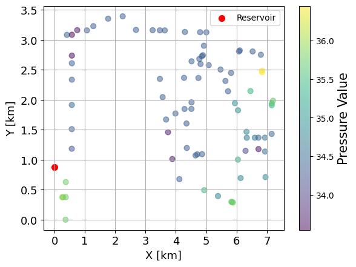

## WDN Topology
Remark that a WDN refers to the collection of pipes, pumps, valves, junctions, tanks, and reservoirs.

The considered network provides n = 85 junctions and m = 1 reservoirs. Each node is configured with a specific base demand pattern which represents the water request of the user during the whole simulation changing at a step size of an hour. 

We analyze the water flow using the Hardy-Cross method that assumes  that the water flow follows a distribution pattern where every junction adheres to the principle of continuity. 
The continuity equation dictates that the algebraic sum of flow rates in pipes converging at a node, along with any external flows, must be zero.
These flows must meet the continuity requirement at every junction, i.e. the algebraic sum of the flow rates in the pipes connecting a junction, together with any demand flows, is zero. 

In WDNs, base demand and satisfied water requests are two distinct concepts related to the amount of water needed and the amount of water that can be successfully supplied to the consumers.
In summary, while base demands represent the foreseen water consumption by users in a WDN, satisfied water request reflects the actual amount of water provided to them, taking into account the network's capacity and available resources and is labelled as demand value.

In the network representation of figure, we can see that, for a specific measurement interval, two color scales are used to plot nodes demand values (color of the circle marker), and pipes flow (color of the nodes connection segment). The reservoir is positioned on the left side of the network (element with 7384 identifier), with flow primarily moving from left to right. As we move further away from the reservoir, the total demand value and pressure at the junctions decrease due to the demand from left-side junctions.

The dataset contains 3 different scenario, all scenarios not present any leakage. For each scenario we set different node interval demand and pattern:
* Base Demand 0 → Nodes do not withdraw water.
* Base Demand 001 → All water demand is satisfied.
* Base Demand 01 → Not all water demand is satisfied.
* Base Demand 05 → Not all water demand is satisfied.
* Pattern Demand → Not all water demand is satisfied.

To create the dataset, we integrate the EPANET (US Environmental Protection Agency water NETwork) and the Water Network Tool for Resilience (WNTR). 
WNTR examines the geometric structure of the pipeline system along with a set of initial conditions (e.g. pipe roughness and diameter) and rules of how the system is operated, so that it can compute flows, pressures and water quality (e.g. disinfection concentrations and water age) throughout the network for a specific period of time.
It is capable of simulating complex WDN infrastructure and obtain all main hydraulic values by a demand-driven analysis (DDA) and a pressure driven analysis (PDA). 

For each scenario we consider two files, the node file focused on the WDN node structure and the link file focused on network pipe that connect junction or node.
To create the present dataset, we decide to output these values in a "DotComma-separated values" (\textit{CSV}) file with the following fields to take account the node:

* hour: A timestamp representing the time-interval we are currently watching in the simulation
* nodeID: Unique ID of a node inside the network
* demand: Rate of water withdrawal from the network. A negative value is used to indicate an external source of flow into the junction
* head: Hydraulic head (i.e., elevation + pressure head) of water in the node of the WDN
* pressure: Measured pressure in the node of the WDN 
* x_pos,y_pos: Coordinates of the node 
* node_type: A string which tells the type of the node (i.e., ”Junction”, ”Reservoir”, ”Tank”)
* has_leak: A boolean (True/False) which tells if a leak is present on that specific node (i.e., if we have a hole leaking water)
* leak_area: Area of the hole (m2)
* leak_discharge: Leak discharge coefficient. Takes on values between 0 and 1 
* current_leak_demand: The current simulation leak demand at the node. The total demand of a node can be viewed as: demand + current_leak_demand

and a file with the following fields to take account the link 
* hour: A timestamp representing the time-interval we are currently watching in the simulation
* linkID: Unique ID of a link inside the network
* link_type: A string which tells the type of the node (setted with "link")
* start_node: The source node of the link
* end_node: The target node of the link
* flowrate: The flow rate of the water inside the pipe at the current timestamp
* velocity: The velocity of the water inside the pipe at the current timestamp

## Performance

